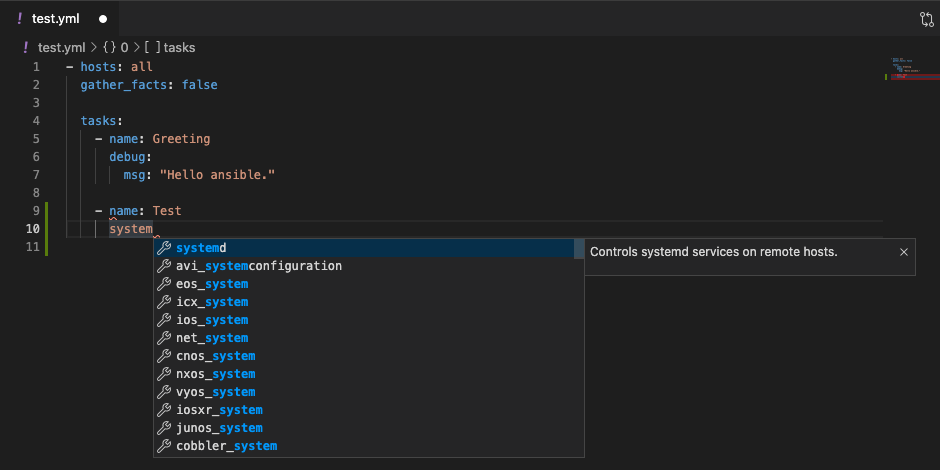
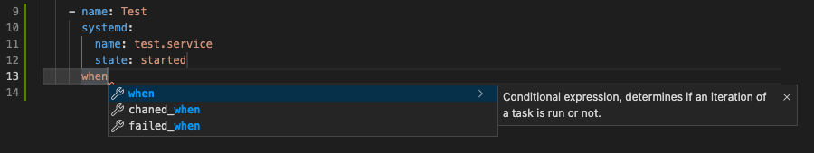

# JSON-Schema for Ansible 2.9

For [YAML of VSCode][redhat.vscode-yaml]

Create json-schemas for ansible playbook and role/task including [json.schemastore.org/ansible-role-2.9].
In addtion, these contain schemas for almost all available [keywords][ansible-keywords].





## Build
```sh
make clean
make all
```

## .vscode/settings sample
```json
{
    "yaml.schemas": {
        "ansible-playbook-2.9.json": ["/test.yml"],
        "ansible-tasks-2.9.json": ["/roles/*/tasks/*.yml"]
    }
}
```

[redhat.vscode-yaml]: https://marketplace.visualstudio.com/items?itemName=redhat.vscode-yaml
[json.schemastore/ansible-role-2.9]: https://json.schemastore.org/ansible-role-2.9
[ansible-keywords]: https://docs.ansible.com/ansible/2.9/reference_appendices/playbooks_keywords.html#term-until